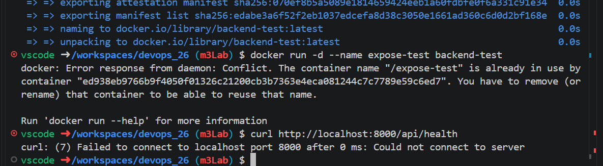
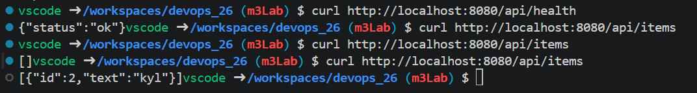
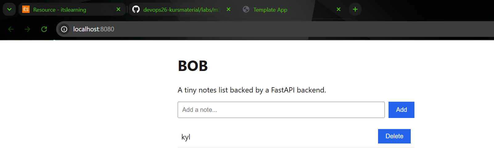
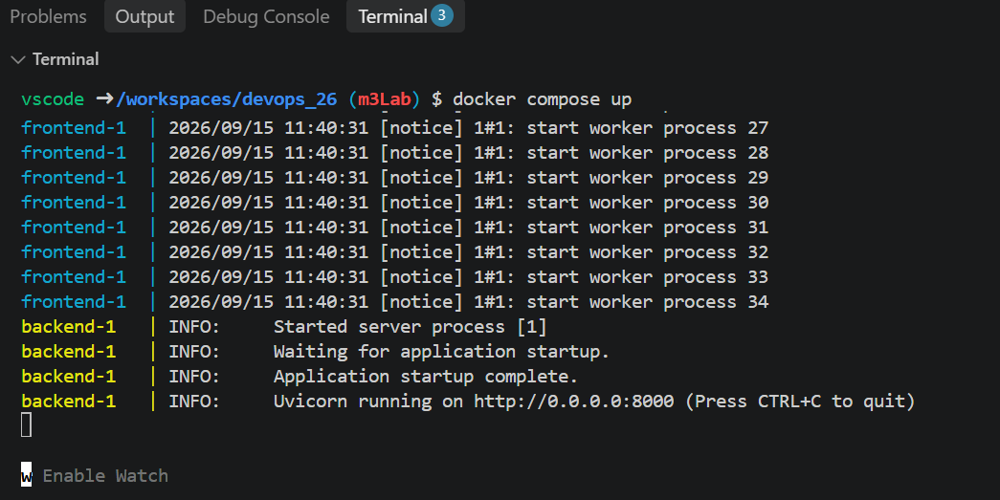

1. Första rad avgör vilken python imagen    bygger på. 

COPY app och copy test körs varhe gång man ändrar på koden. Om RUN skulle vara efter app skulle det köras varje gång. 

EXPOSE 8000 gör inte porten nåbar. Utanför containern.

2. Det finns ingen RUN för att dockerfilen konfiguerear barA NGINX filen. Rad proxy_pass http://backend:8000/api/; talar med backenden. Backend namnet kommer från vår folder structure. 

