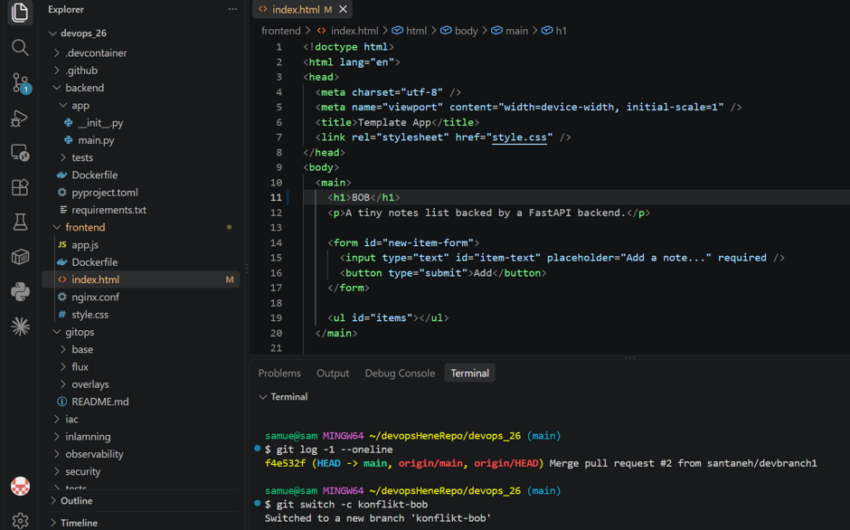

# M0 — Exempel: så här dokumenterar ni det osynliga arbetet

> Det här är en exempelfil. Vid varje milstolpe skapar ni en egen fil här,
> t.ex. `inlamning/m7-cloud.md`, som dokumenterar det arbete som **inte
> syns i repot** — konsolklick, inställningar på GitHub, terraform-körningar
> osv. Filformatet är fritt — `.md`, `.txt`, Word eller vad ni är bekväma
> med — men filen ska ligga i `inlamning/` med namnet `mN-<kort-namn>` och
> committas vid varje tagg.

## Vad vi gjorde utanför repot

Vi skapade ett konto på Exempeltjänsten och aktiverade
tvåfaktorsautentisering. I webbkonsolen slog vi på inställningen
"Require review" för vårt projekt. Vi verifierade att inställningen
fungerar genom att försöka spara utan granskning — det blockerades,
precis som förväntat. Skärmdumpen nedan visar konsolen efter ändringen.

## Skärmdump

*Lägg bildfilen i samma mapp (`inlamning/`) och committa den tillsammans
med texten — `.gitignore` tillåter bilder.*

## Format

- 3–5 meningar: vad ni gjorde, var (vilket verktyg/konsol) och hur ni
  verifierade att det fungerade.
- Minst en skärmdump eller ett terminalutdrag när milstolpen har arbete
  utanför repot.
- Filnamn: `mN-<kort-namn>.<valfri ändelse>` (samma nummer som
  milstolpens tagg) — `.md` här är bara ett exempel, `.txt`, Word eller
  vad ni är bekväma med går lika bra.

## Konfliktövningen
Jag ändrade h1 Till BOB. 

Efter att vi ändrade på samma line och gjorde det på samma branch orsakade det att vi behövde "resolve conflict"

Jag tog bilden efter jag valde "accept incoming changes" h1 blev alltså BOB och <<<<< raderades. 

conflict solved.
