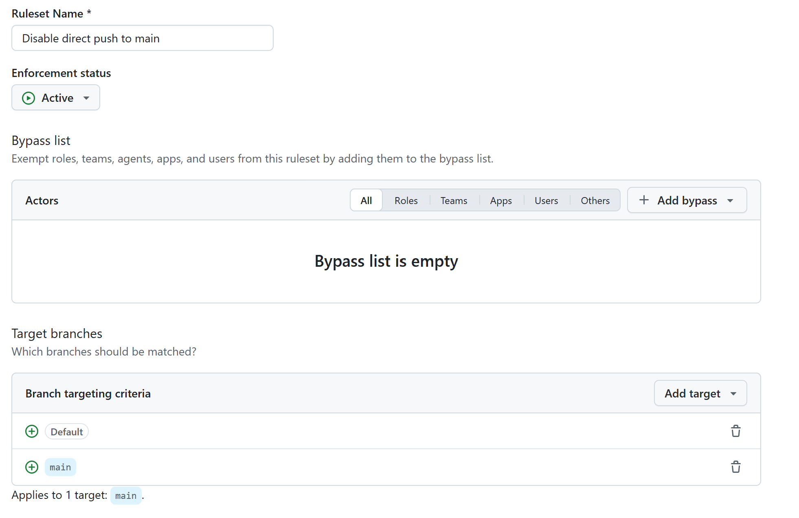
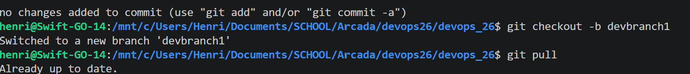
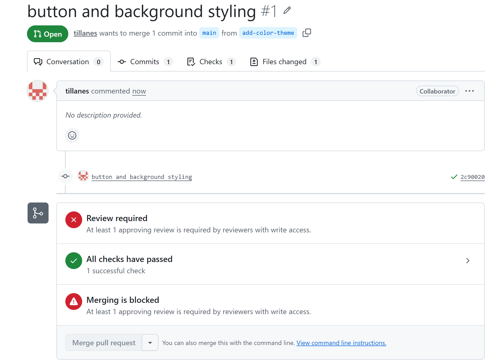
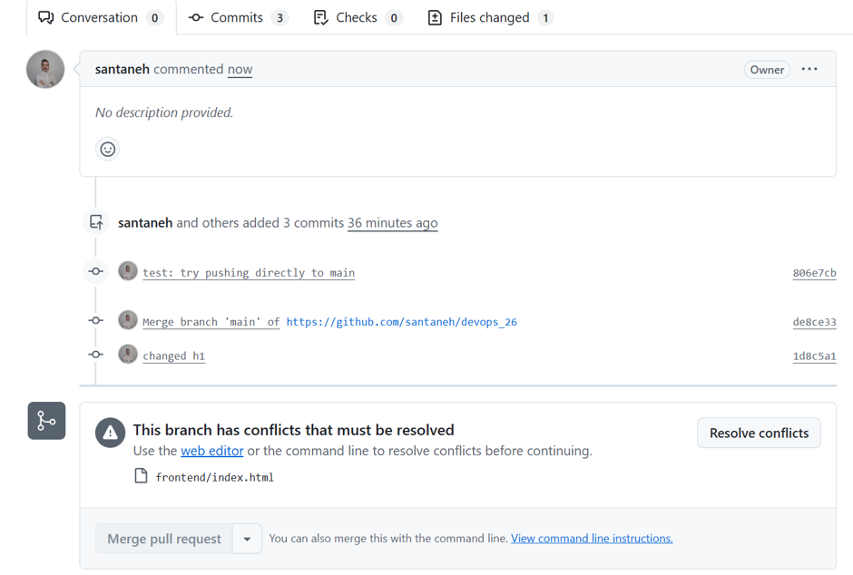
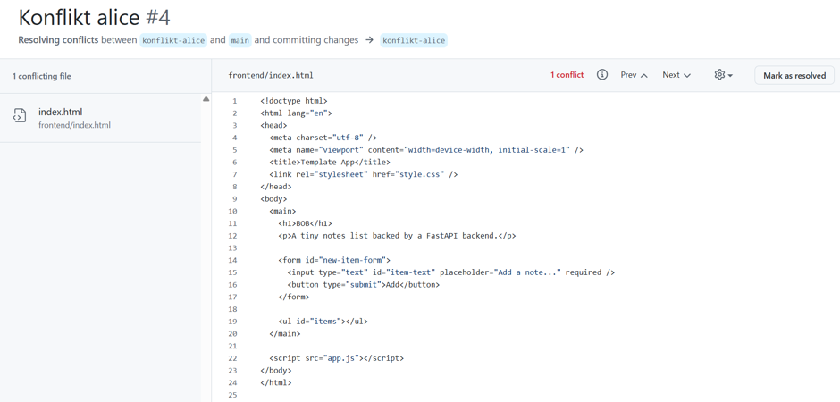
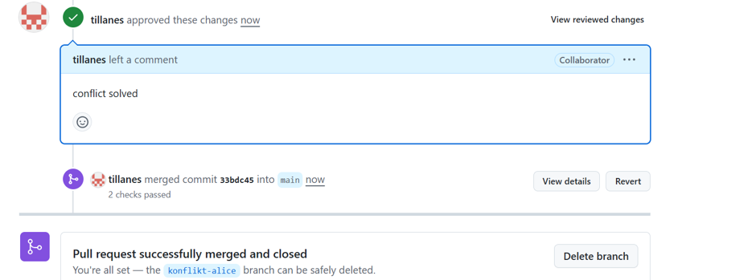

# Milstolpe 2 – Branch protection, review och konflikt

## Ruleset

Vi skapade en ruleset för repot som kräver en godkänd pull request innan
ändringar får mergas till main. Enforcement status sattes till Active och
bypass-listan lämnades tom, så regeln gäller alla.

## Ny branch

Vi skapade en egen branch per uppgift så att vi kunde arbeta individuellt.

## Commit och merge

Varje pull request krävde minst en godkänd review innan den fick mergas
till main. Det andra paret gick igenom ändringarna och godkände dem innan
merge.

## Konfliktövningen

Vi skapade en merge-konflikt genom att ändra samma rad, `h1`-rubriken, till BOB på varsin branch.

Eftersom samma rad ändrats på båda brancherna gick den senare pull
requesten inte att merga förrän konflikten var löst.

Konflikten löstes genom att välja "accept incoming changes": `h1` blev
BOB och konfliktmarkörerna (`<<<<<<<`) togs bort.

Pull requesten godkändes och mergades efter att konflikten var löst.

