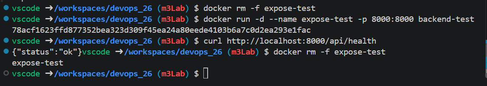
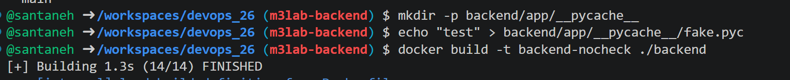
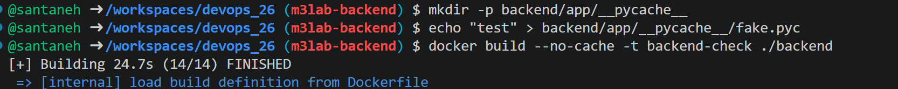
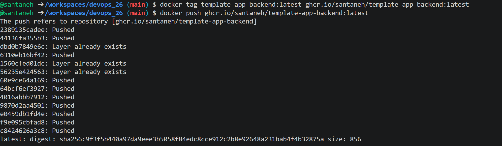

# Milstolpe 3 – Dockerfiles, docker compose och GHCR

## Steg 1 – Backend-Dockerfile

Innan vi gjorde något läste vi igenom `backend/Dockerfile` och gjorde tre
gissningar:

- Den första `FROM`-raden avgör vilken Python-version imagen bygger på.
- `COPY requirements.txt` och `RUN pip install` ligger före `COPY app
  ./app` så att beroendena bara installeras om när `requirements.txt`
  ändras — inte varje gång koden i `app/` ändras.
- `EXPOSE 8000` gör inte porten nåbar utanför containern, det är bara
  dokumentation.

Vi testade den tredje gissningen: utan `-p` gav `curl` "Could not connect
to server", men med `-p 8000:8000` svarade den `{"status":"ok"}`, vilket
bekräftade gissningen.

## Steg 2 – Frontend-Dockerfile

Frontend-Dockerfilen har ingen `RUN`-rad eftersom den bara kopierar in
färdiga filer och en `nginx.conf` — ingen installation behövs. Raden
`proxy_pass http://backend:8000/api/;` fungerar eftersom `backend` är
tjänstenamnet i `docker-compose.yml`, inte en mappstruktur.

## Steg 3 – Docker compose

`docker compose up --build` startade både backend och frontend, och appen
svarade på `localhost:8080`. Anrop till `/api/health` och `/api/items`
gick via nginx-proxyn vidare till backend.

## Steg 4 – .dockerignore

Utan en `.dockerignore` hamnade `__pycache__`-filer i imagen eftersom
`COPY app ./app` kopierade med dem. Efter att vi lade till
`backend/.dockerignore` och `frontend/.dockerignore` och byggde om med
`--no-cache` gav `find /app -iname "*pycache*"` en tom utskrift, vilket
bekräftade att filtreringen fungerade.

## Steg 5 – Push till GHCR

Vi taggade backend-imagen med `docker tag` och pushade den till
`ghcr.io/santaneh/template-app-backend:latest` med `docker push` —
samma gjordes med frontend-imagen. Vi verifierade pushen genom att
kontrollera på GitHub, under repots **Packages**-flik, att båda paketen
var uppe.

