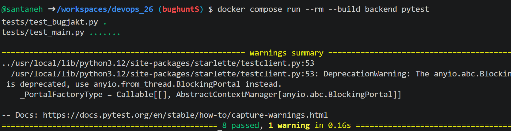
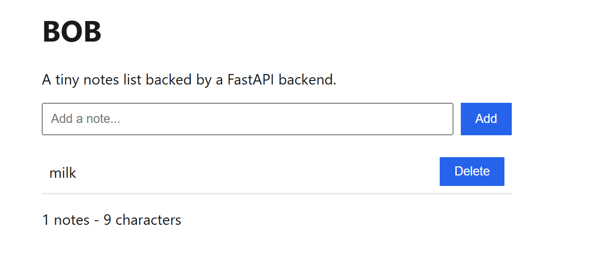
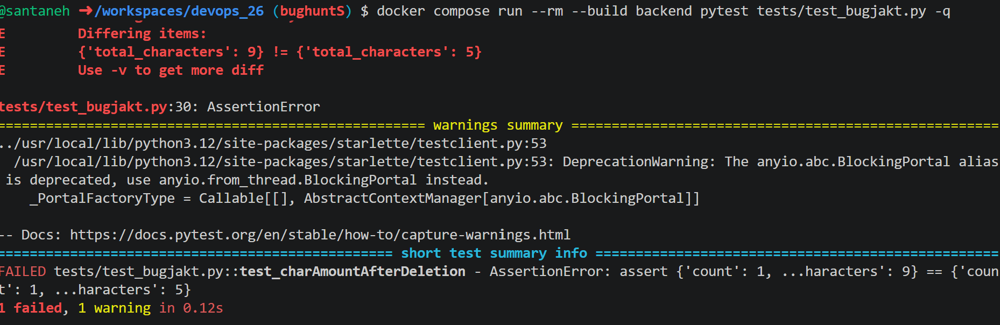
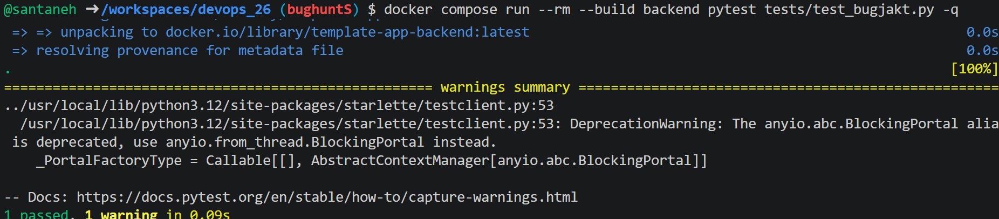
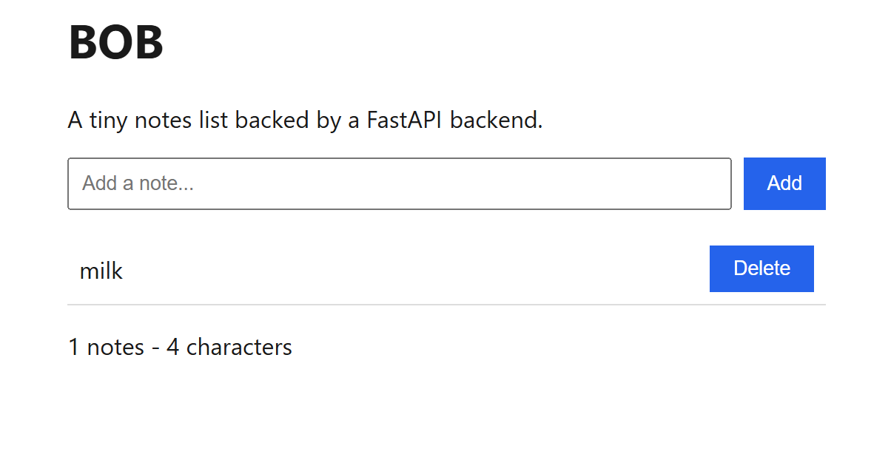

## Milstolpe 4 – Buggjakt

Vi började med att köra alla tester för backend.

Alla tester gick igenom, men vi visste ändå att det fanns en bugg i systemet. Vi startade applikationen med `docker compose up` för att undersöka användargränssnittet och försöka återskapa buggen.

På bilden lade vi först till anteckningarna "bread" och "milk" och tog därefter bort en av dem. Characters i användargränssnittet uppdaterades inte när en anteckning togs bort.

Testerna gick igenom eftersom de inte täckte alla tänkbara skenarion, till exempel att en användare först lägger till och sedan tar bort en anteckning. De testade enbart enskilda fall, som att skapa eller ta bort en anteckning eller att skapa flera anteckningar och uppdatera characters.

Vi skrev ett nytt test i `test_bugjakt.py` som lägger till anteckningar och sedan tar bort en av dem. Testet misslyckades och visade ett felmeddelande när vi körde det, vilket bekräftade buggen.

När vi hade ett fungerande test rättade vi koden i `main.py`. Characters uppdateras nu även när en anteckning tas bort, och inte bara när en anteckning läggs till.

När testet gick igenom kontrollerade vi också resultatet i användargränssnittet.

Därefter körde vi alla tester igen. De gick fortfarande igenom, vilket visar att rättningen inte har förstört någon annan funktionalitet.

Till sist committade vi ändringen till en separat gren och mergade den med main.

## Vad som hade behövts för att buggen aldrig skulle ha nått main

För att förhindra den här typen av buggar behöver projektet bättre tester i pytest som även täcker kombinationer av åtgärder, till exempel att lägga till och sedan ta bort en anteckning. Ändringarna bör dessutom granskas mer noggrant och testas i en separat gren innan de mergas med main och går vidare till produktion. Peer review är också viktiga och kan göra att man märker buggen före koden mergas med main.
