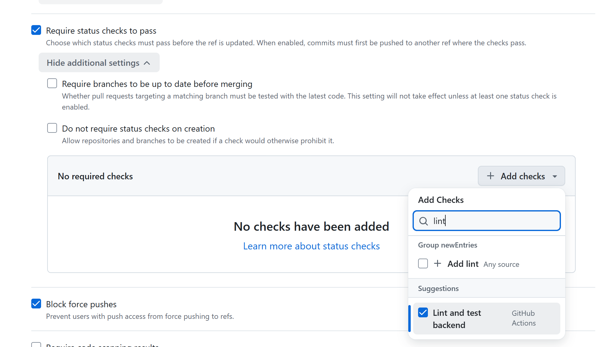
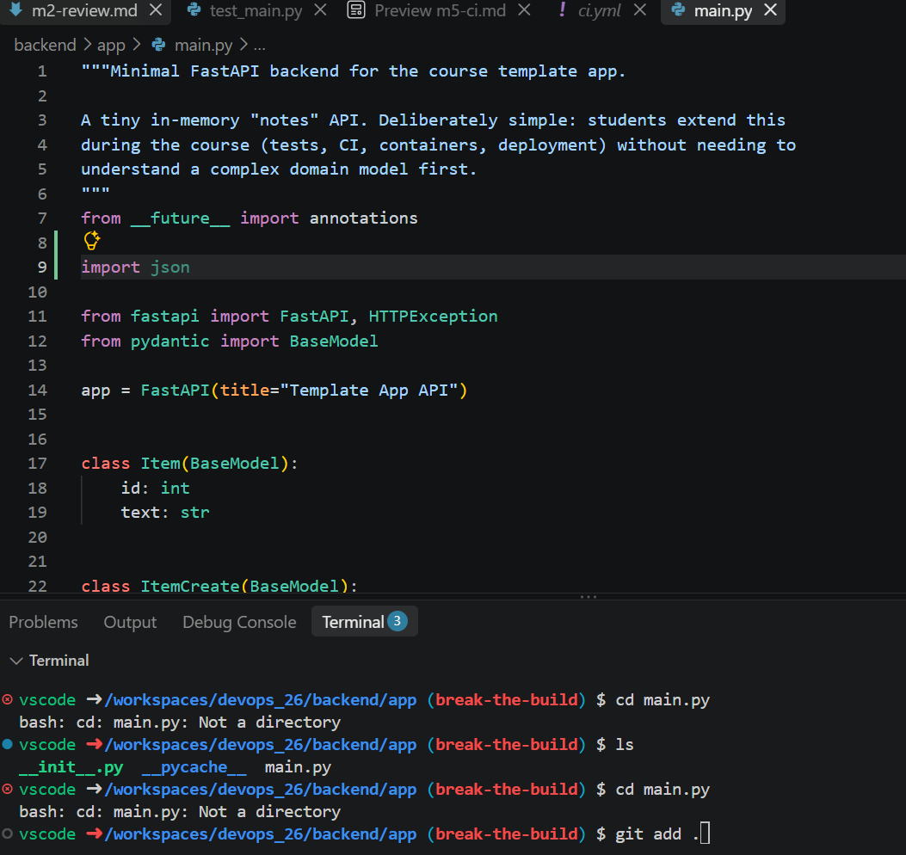
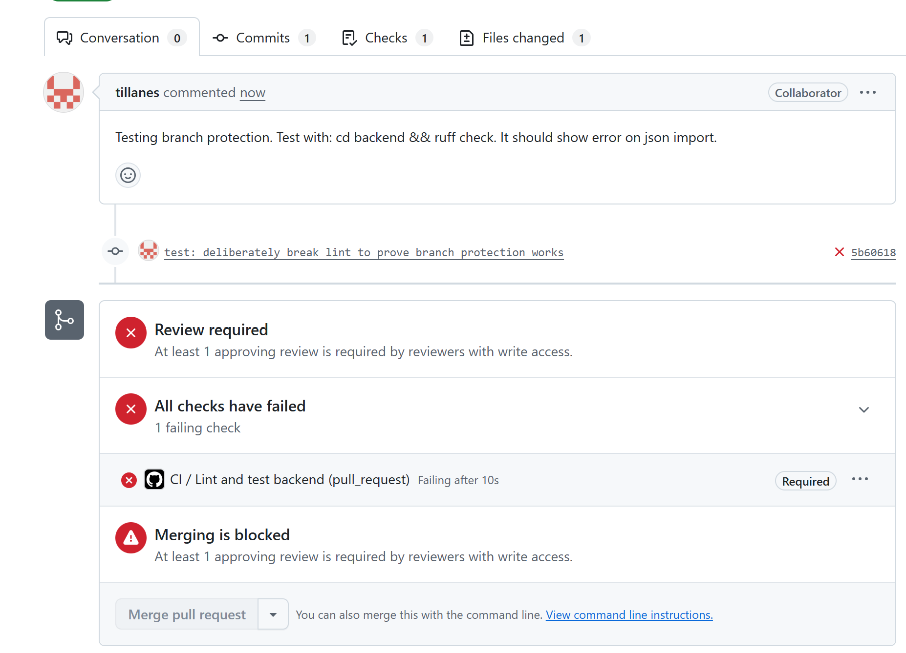
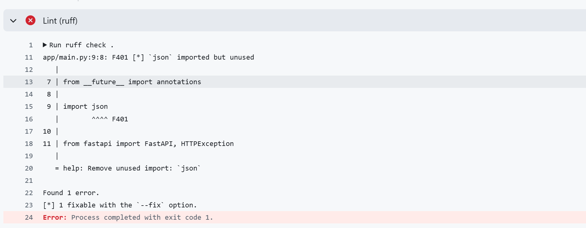
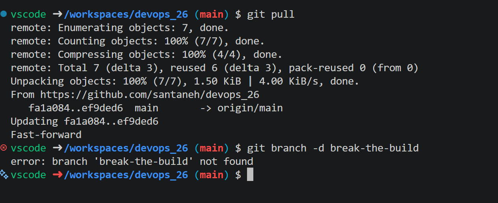
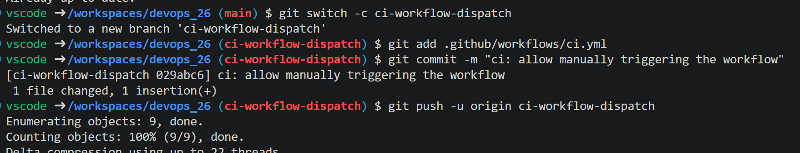
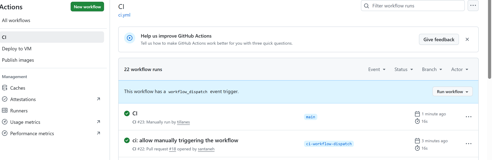
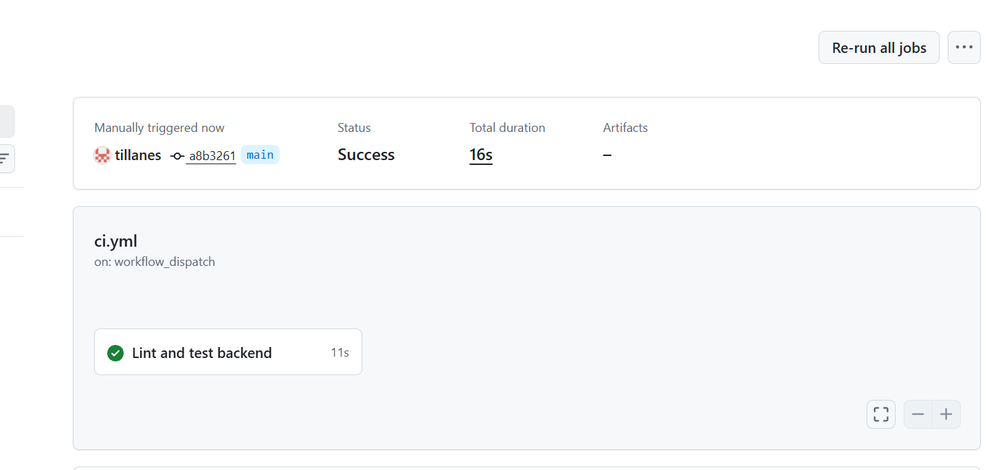

# Milstolpe 5 – CI Check

## Steg 1 – Gör checken obligatorisk

I rulesetet för `main` från M2 kryssade vi i Require status checks to pass
och lade till checken Lint and test backend, som är namnet på jobbet i
`ci.yml`. Förut syntes checken på varje pull request men kunde inte stoppa
något. Nu måste den vara grön innan en PR får mergas.

## Steg 2 – En medvetet röd PR

På en ny branch, `break-the-build`, lade vi till en oanvänd import,
`import json`, i `backend/app/main.py` så att `ruff` skulle klaga.

När vi öppnade pull requesten blev checken röd och merge-knappen blev grå
och gick inte att klicka på (*Merging is blocked*).

I loggen under **Details** såg vi att `ruff` pekade ut exakt rätt rad:
`F401 json imported but unused` på rad 9 i `main.py`.

## Steg 3 – Fixa och merga grönt

Vi tog bort importen och pushade igen (`fix: remove unused import`). Checken
körde om och blev grön, PR:en godkändes och mergades och vi tog bort branchen. Sedan körde vi
`git pull` på `main` . `git branch -d break-the-build` och såg att branchen var borta

## Steg 4 – Manuell trigger med workflow_dispatch

På branchen `ci-workflow-dispatch` lade vi till `workflow_dispatch:` under
`on:` i `.github/workflows/ci.yml`, i samma kolumn som `pull_request:`.
Ändringen gick in via en egen PR (#18) som granskades och mergades.

Efter mergen fanns knappen **Run workflow** under **Actions** → **CI**. Vi
startade en körning på `main` utan att öppna någon pull request, och den
syns som "Manually run".

Körningen var triggad av `workflow_dispatch`, och jobbet Lint and test
backend gick igenom.

