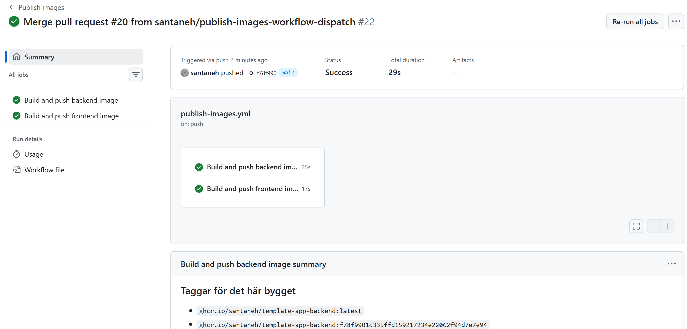
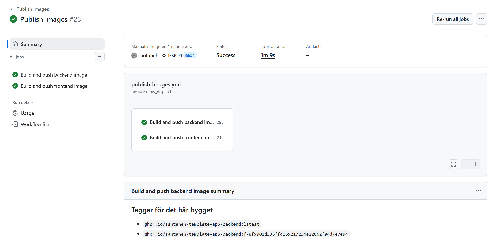
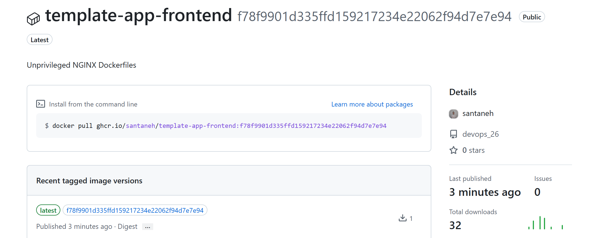
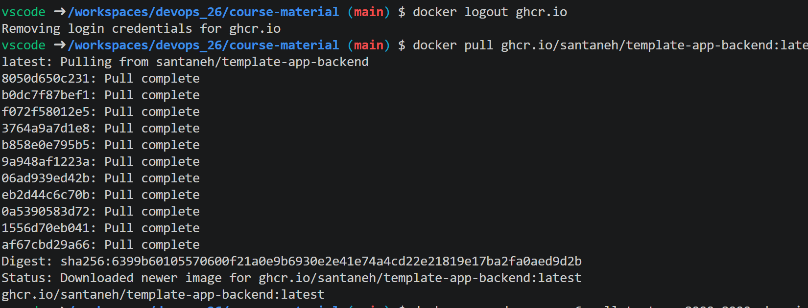
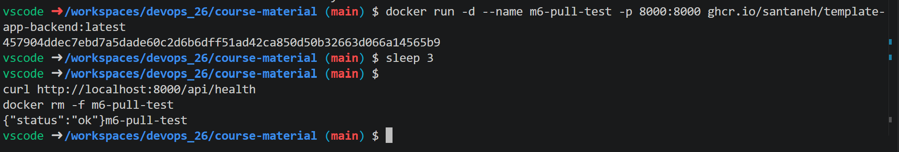
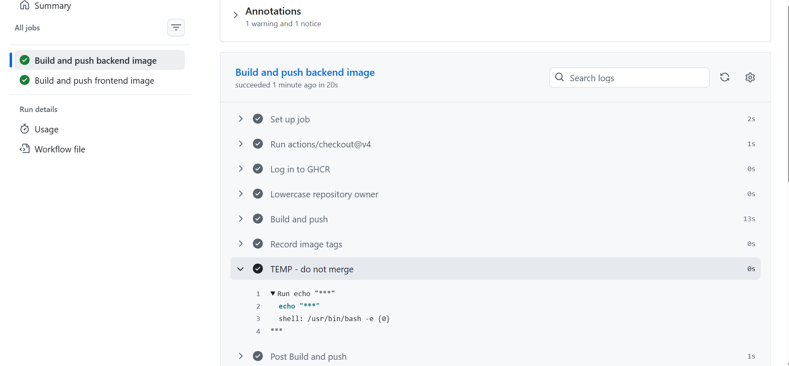

# Milstolpe 6 – CD publish-images

## Steg 2 – Egen ändring i publish-images.yml

På branchen `publish-images-workflow-dispatch` lade vi till `workflow_dispatch:`
under `on:` i `.github/workflows/publish-images.yml`, i samma kolumn som
`push:`. Vi lade också till ett nytt sista steg, `Record image tags`, i båda
jobs som skriver bildens taggar till körningens sammanfattning via
`$GITHUB_STEP_SUMMARY`. Ändringen gick in via en egen PR (#20) som granskades
och mergades.

## Steg 3 – Automatiken end-to-end

Efter det en push till `main` triggades Publish images
automatiskt. Båda jobben,
Build and push backend image och Build and push frontend image, blev gröna. Under
jobbgrafen syns avsnittet Taggar för det här bygget med `:latest` och
`:f78f990…`, alltså commitens sha, som vårt nya steg skrev ut.

Efter mergen fanns knappen Run workflow i Actions. 
Vi startade en körning på `main` manuellt.

## Steg 4 – Publika paket

Våra packages var färdigt public troligen på grund av att repot också är public.

## Steg 5 – Pull utan inloggning

Vi körde `docker logout ghcr.io`. Sedan körde vi `docker pull` på backend-imagen, och det gick
utan att vi behövde logga in.

Vi startade containern med `docker run -d --name m6-pull-test -p 8000:8000`,
väntade några sekunder och anropade `curl http://localhost:8000/api/health`.
Svaret blev `{"status":"ok"}`, så imagen från GHCR fungerar. Till sist tog
vi bort containern med `docker rm -f m6-pull-test`.

## Steg 6 – Secrets-övning

På en egen branch, `secrets-masking-demo`, lade vi till ett temporärt steg
`TEMP - do not merge` som körde `echo "${{ secrets.GITHUB_TOKEN }}"`. Vi
startade workflowen manuellt på den branchen. I loggen visas värdet som
`***`. Direkt efteråt raderade vi branchen både lokalt
och på GitHub.

### Varför övningen är säker med GITHUB_TOKEN men inte med en PAT

GITHUB_TOKEN skapas automatiskt för varje jobb i GitHub Actions och slutar
gälla när jobbet är klart. När loggen går att läsa på GitHub är token alltså
redan ogiltig, så det gör inget om den skulle läcka ut. En PAT är personlig och
skapas för manuelt. Den kan gälla i till exempel en vecka eller 90 dagar, och om
den läcker ut kan någon annan använda den tills den går ut eller tas bort.
Därför ska man aldrig göra övningen med en riktig PAT.