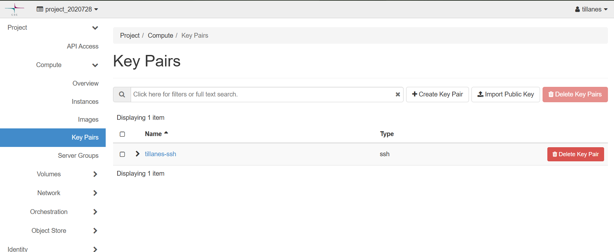
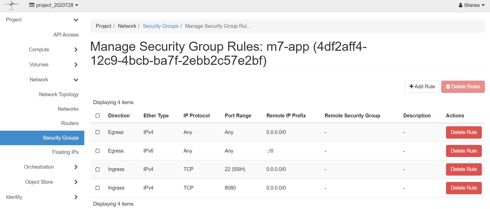
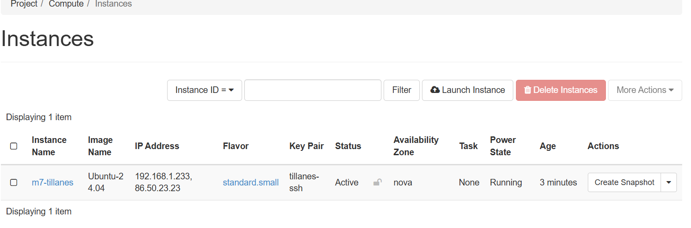
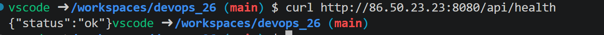
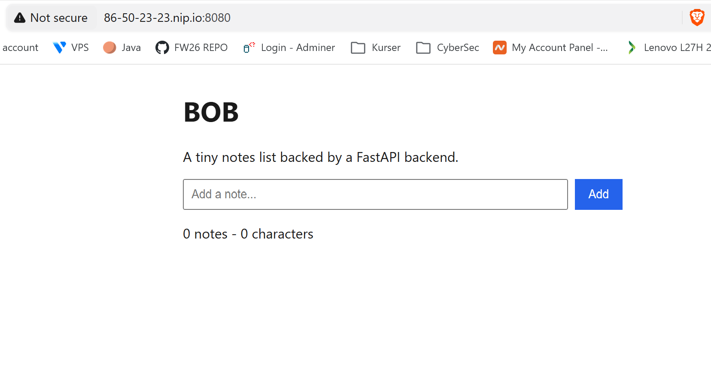

# Milstolpe 7 – VM i cPouta

## Steg 1–2 – SSH-nyckel och Key Pairs

Båda skapade en nyckel med kommandot
`ssh-keygen -t ed25519 -f ~/.ssh/cpouta_ed25519` och satte en lösenfras. I
cPouta-konsolen gick vi och importerade båd keys.

## Steg 3 – Security group

Under Network → Security Groups skapade vi gruppen `m7-app`. Vi lade till två
regler: en SSH-regel för port 22 och en Custom TCP Rule för port 8080. 

## Steg 4–5 – Instans och floating IP

Vi skapade en virtual machine i cPouta och lade till en Associate Floating IP.Vi fick 2 IP adresser.
`192.168.1.233` och floating IP:n `86.50.23.23`.

## Steg 6–9 – SSH, Docker och compose

Vi loggade in med ssh nyckeln och lade till parets ssh nyckel. Sedan loggade paret in med sin ssh nyckel och installerade docker och körde containers med docker compose up.

## Steg 10 – Verifiera utifrån

Vi körde `curl http://86.50.23.23:8080/api/health` utanför cPouta VM och svaret blev `{"status":"ok"}`

Till sist öppnade vi `http://86-50-23-23.nip.io:8080/` i webbläsaren, och
notes-appen visades.

