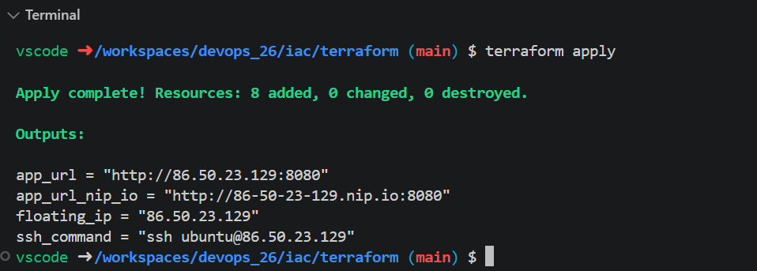
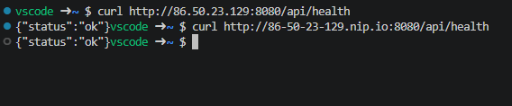
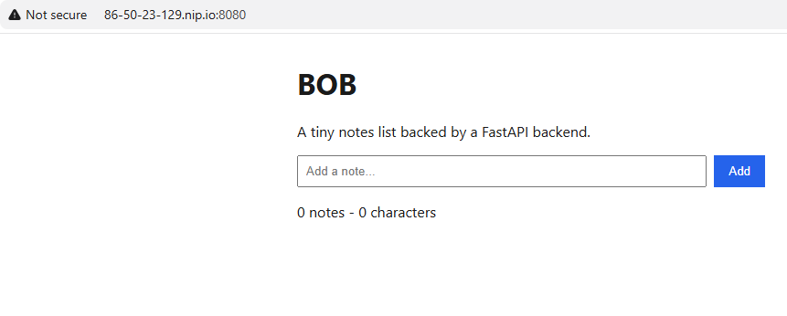
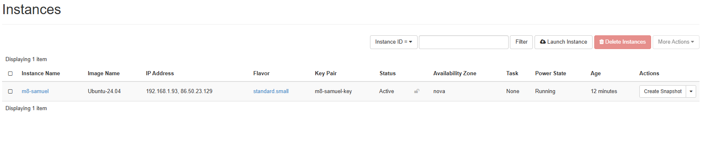
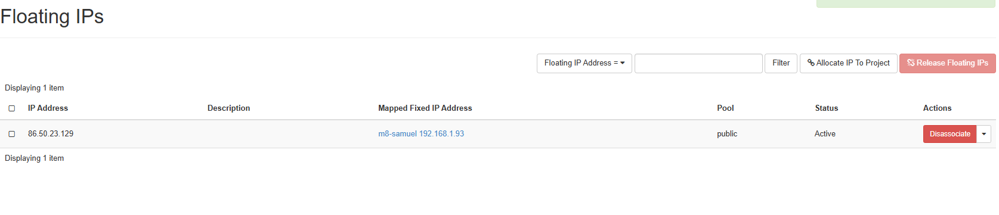
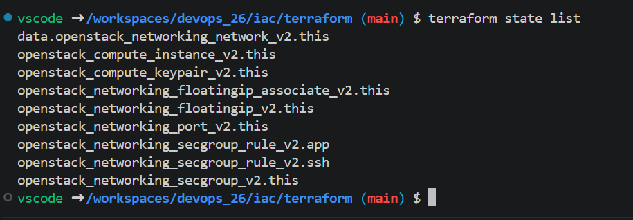
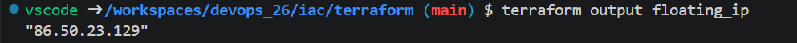
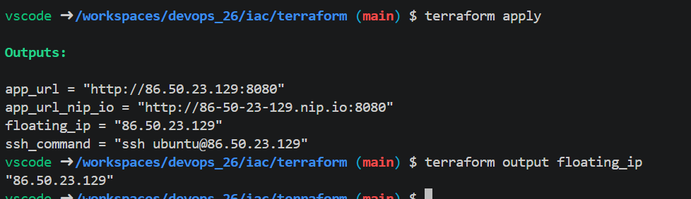
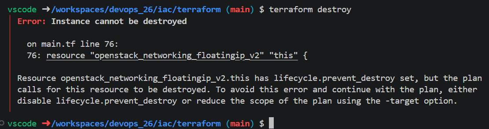

# Milstolpe 8 – Terraform (IaC)

## Steg 1–3 – clouds.yaml, variabler och validering

Vi båda skapade en application credential i cPouta Identity → Application och laddade ner `clouds.yaml`. Filen lade vi i
`~/.config/openstack/clouds.yaml` och körde `export OS_CLOUD=openstack`

Sedan fixade vi `terraform.tfvars` filen och körde `terraform init
-backend=false` och `terraform validate` som gick igenom utan fel.

## Steg 4 – terraform apply

Vi körde `terraform init`, `terraform plan` och `terraform apply`. Planen
visade 8 resurser som sku skapas. När vi körde apply och svara `yes` fick vi `Apply complete! Resources: 8 added`.

## Steg 5 – Verifiera utifrån

Efter några minuter körde vi `curl` mot både
floating IP:n och nip.io-adressen från codespacen. Båda svarade
`{"status":"ok"}`.

Vi öppnade `http://86-50-23-129.nip.io:8080/` i webbläsaren och notes-appen
visades

## Steg 6 – Riv M7-VM:en och släpp dess floating IP

I cPouta raderade vi M7-instansen `m7-tillanes` under Compute → Instances.

Vi gjorde samma med floating IP. Efter var bara M8:s adress `86.50.23.129` kvar.

## Steg 7 – terraform state list

Vi körde `terraform state list` och fick en output.

## Steg 8 – Rebuild: riv VM:en, behåll IP:n

Innan vi rev något körde vi `terraform output floating_ip`, för att se vårt IP adress.
`"86.50.23.129"`.

Sedan rev vi bara instansen med
`terraform destroy -target=openstack_compute_instance_v2.this` och byggde upp
den igen med `terraform apply`. Efteråt gav `terraform output floating_ip`
exakt samma adress, `"86.50.23.129"`. Då märkte vi att vår terraform fungerar och kan skapa och radera instanser.

## Steg 9 – Bonus: terraform destroy vägrar

Vi testade också om terraform prevent destroy fungerar. Vi körde `terraform destroy` utan `-target`. Terraform stoppade
direkt med `Error: Instance cannot be destroyed`.Ingenting revs ner och appen svarade fortfarande.

