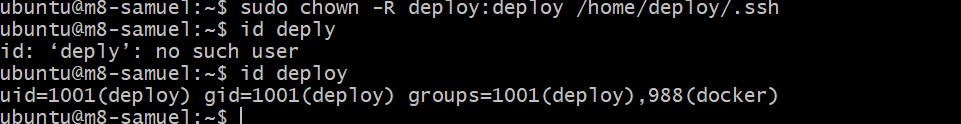
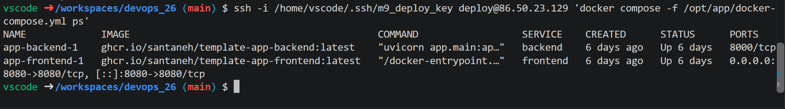
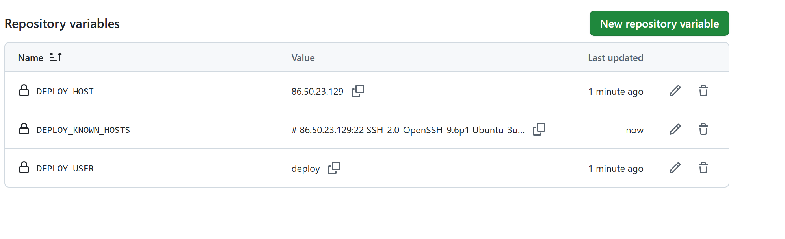
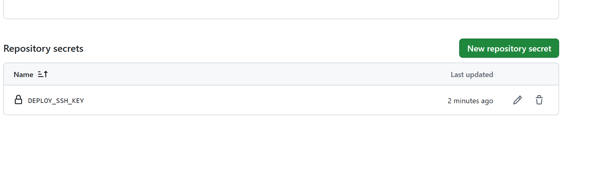
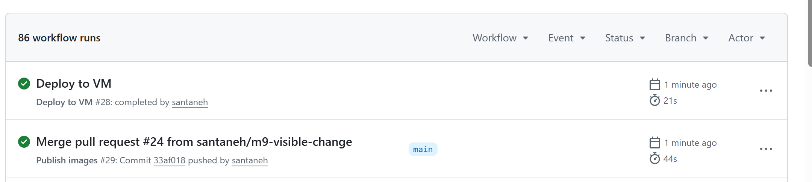
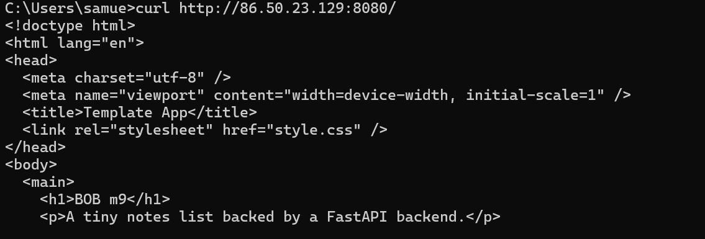
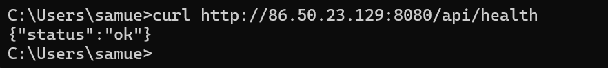
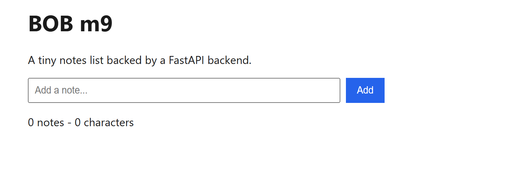

# Milstolpe 9 – CD med SSH-deploy

## Steg 2 – deploy.yml och deploy-nyckel

Vi skapade en ny nyckel bara för deployen med
`ssh-keygen -t ed25519 -C "m9-deploy" -f ~/.ssh/m9_deploy_key -N ""`.

## Steg 3 – Deploy-användaren på VM:en

Vi loggade in på VM:en `m8-samuel` som `ubuntu` och skapade användaren
`deploy`, lade den i `docker`-gruppen och lade in den publika nyckeln i
`/home/deploy/.ssh/authorized_keys`. Med `id deploy` kollade vi att
användaren finns och har gruppen `docker`.

## Steg 4 – Testa deploy-nyckeln

Från codespacen körde vi ssh kommando och docker kommandot. Båda containrarna stod som `Up`, utan `sudo`, så nyckeln och
docker-gruppen fungerade.

## Steg 5–6 – Host-nyckel, secrets och variabler

Vi körde `ssh-keyscan -H 86.50.23.129` och sparade utskriften. I GitHub under
Settings → Secrets and variables → Actions lade vi till variablerna
`DEPLOY_HOST`, `DEPLOY_USER` och `DEPLOY_KNOWN_HOSTS`.

Den privata nyckeln lade vi som secret `DEPLOY_SSH_KEY`, eftersom den är
hemlig. Värdet syns inte i GitHub.

## Steg 7–9 – Github Action

Vi ändrade vi `<h1>` i`frontend/index.html` till `BOB m9` och mergade det via PR. Efter mergen till main blev först `Publish images` grön och sedan `Deploy to VM` grön i Repots Actions.

## Steg 10 – Verifiera utifrån

Vi körde `curl` mot floating IP:n från en egen dator. Sidan visade den nya
rubriken `BOB m9`.

`/api/health` svarade `{"status":"ok"}`.

Till sist öppnade vi `http://86.50.23.129:8080/` i webbläsaren och
ändringen syntes, utan att vi loggat in på VM:en under deployen.

